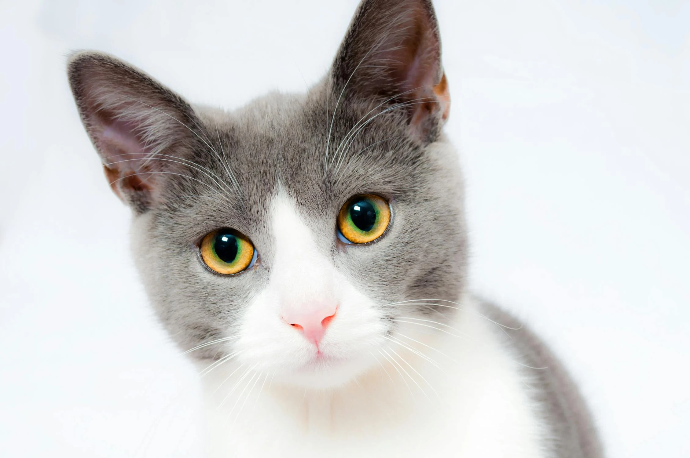

# Image Pixelizer

### <u>Simply, Pixelate an Image.</u>

|  |  |
|:-------------------------------------------------------------------------------------------------------------------------------------------------:| ---------------------------------------------------------------------------------------------------------------------- |

