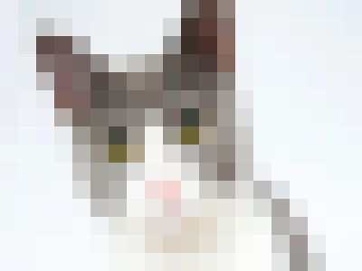

# Image Pixelizer

### <u>Simply, Pixelate an Image.</u>




```js
function pixelateImage(image, ctx, pixelSize) {
        const width = image.width;
        const height = image.height;
        ctx.drawImage(image, 0, 0, width, height);
        const imgData = ctx.getImageData(0, 0, width, height);
        const data = imgData.data;

        for (let y = 0; y < height; y += pixelSize) {
            for (let x = 0; x < width; x += pixelSize) {
                const startIndex = (y * width + x) * 4;

                let totalR = 0, totalG = 0, totalB = 0;
                let count = 0;

                for (let j = 0; j < pixelSize; j++) {
                    for (let i = 0; i < pixelSize; i++) {
                        const index = ((y + j) * width + (x + i)) * 4;
                        totalR += data[index];
                        totalG += data[index + 1];
                        totalB += data[index + 2];
                        count++;
                    }
                }

                const avgR = totalR / count;
                const avgG = totalG / count;
                const avgB = totalB / count;

                for (let j = 0; j < pixelSize; j++) {
                    for (let i = 0; i < pixelSize; i++) {
                        const index = ((y + j) * width + (x + i)) * 4;
                        data[index] = avgR;
                        data[index + 1] = avgG;
                        data[index + 2] = avgB;
                    }
                }
            }
        }
        ctx.putImageData(imgData, 0, 0);
    }
```


